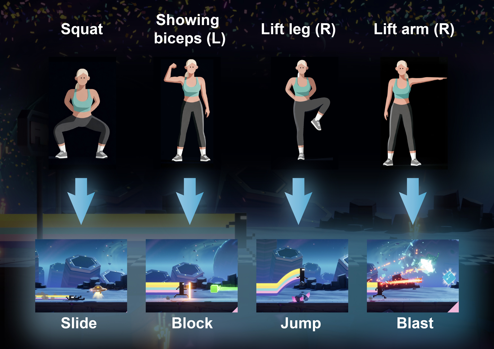

# 🎮 MOTION2KEY_BitController
This project turns camera-based human pose into real-time game controls. 

It detects user actions via MediaPipe Pose enhanced with robust logic, and sends corresponding keystrokes to the foreground application—enabling full-body motion control for any game. The current version is fully compatible with BIT.TRIP RUNNER, a rhythm-based platformer.

It also logs joint movement metrics, and generates comprehensive Excel/CSV reports along with a dashboard summary of the previous game level. The analysis includes Action Counts, Range of Motion (ROM) per joint, and Grouped Averages by Action Type.

## 🚀 How to Run

1. **Launch the application**  
   Run:
   ```
   \MOTION2KEY_BitController\dist\Bit Controller.exe
   ```
   Wait until the **Bit Controller** interface appears.

2. **Open your target game**  
   Start the game you wish to control (e.g., *BIT.TRIP RUNNER*).

3. **Snap game window**  
   Click **“Snap Game”** in the Bit Controller UI.  
   This will automatically position the game window in the appropriate location on the interface.  
   You can re-click it anytime if you wish to readjust the alignment.

4. **Start motion control**  
   Click **“Start”** to activate the camera.  
   The system will detect your body movements in real time and convert them into virtual key presses controlling the game.

5. **Show supported actions (optional)**  
   Click **“Show Hint”** to view the currently supported motion commands.

   

6. **Stop and review**  
   When your session is finished, click **“Stop”** to turn off the camera.  
   A **Summary Dashboard** will be automatically generated, showing your motion performance metrics for the previous session.

   

---


##🧩 Lightweight Version 

Resolved the large file size issue required for running after cloning.
All functionalities can now be executed directly via Python without the executable.`Bit Controller.exe`

This is a lightweight UI that uses a camera feed to map body movements to keystrokes and interact with a focused game window on Windows.

The repo contains only:

```
UI_app.py
move_to_key_V10.py
```

> The UI can: show live camera preview, start/stop the controller thread, “Snap” the currently focused game window into a placeholder area (non-resizing reposition), “Recover” a window if it flies off-screen, show a hint image, and display the latest summary dashboard image after stopping.

---

### 1) Prerequisites

- **Python 3.10+** (3.10 recommended)
- **Windows 10/11** (full features incl. window snapping via `pywin32`).  
  > macOS/Linux work for the UI & camera, but window moving (`win32gui/win32con/win32api`) is Windows-only.

Optional but recommended:
- **Visual Studio Code** (easier interpreter selection & integrated terminal)

---

### 2) Create a Virtual Environment

> **Windows — PowerShell (recommended)**
```powershell
& "C:\Users\<YOUR_USER>\AppData\Local\Programs\Python\Python310\python.exe" -m venv .venv
.\.venv\Scripts\Activate.ps1
# If activation is blocked, temporarily allow it for this PowerShell session:
# Set-ExecutionPolicy -Scope Process -ExecutionPolicy Bypass
# .\.venv\Scripts\Activate.ps1
```

> **Windows — cmd.exe**
```cmd
C:\Path\To\Python310\python.exe -m venv .venv
.\.venv\Scripts\activate.bat
```

> **macOS/Linux**
```bash
python3 -m venv .venv
source .venv/bin/activate
```

You should now see `(.venv)` in your terminal prompt.

---

## 3) Install Dependencies

Install the required packages into the **activated** virtual environment.

> **Windows**
```powershell
python -m pip install --upgrade pip wheel setuptools
python -m pip install opencv-python numpy PyQt5 pywin32 mediapipe==0.10.14
```

> **macOS/Linux**
```bash
python -m pip install --upgrade pip wheel setuptools
python -m pip install opencv-python numpy PyQt5 mediapipe==0.10.14
# (pywin32 is Windows-only; not needed here)
```

**Optional (for reports/plots you might generate):**
```powershell
python -m pip install matplotlib pandas openpyxl
```

---

## 4) Quick Self-Check

Verify the environment and OpenCV install:

```powershell
python - << 'PY'
import sys, cv2
print("Python:", sys.version.split()[0])
print("cv2:", cv2.__version__)
print("Executable:", sys.executable)
PY
```

Make sure `Executable:` points to `...\your_project\.venv\Scripts\python.exe`.

---

## 5) Run the UI

> **Windows / PowerShell**
```powershell
# In the project folder
python ".\UI.py"
```

> **macOS/Linux**
```bash
python ./UI.py
```

---

## 6) What Each Button Does

- **Start**  
  Launches the controller thread (`start_controller(source="0")` in `move_to_key_V10.py`).  
  - `source="0"` uses the default camera. If your camera index differs, adjust there.

- **Stop**  
  Stops the controller (`stop_controller()`), then tries to open the latest
  `Data Recording/<NEWEST>/summary_dashboard.png` in a resizable dialog.

- **Snap Game**  
  Moves the **currently focused external window** to the right-hand placeholder (without resizing that window), adjusting the main window size if necessary.  
  - Works on **Windows** (uses `win32gui`, `win32con`, `win32api`).
  - Before clicking, bring your game window to the **foreground** (Alt-Tab), then click **Snap Game** in the UI.

- **Recover**  
  If the tracked external window went off-screen, repositions it back to `(100, 100)` (Windows only).

- **Show Hint**  
  Opens a resizable viewer for `hint.jpg` if present in the same folder as `UI.py`.

---

## 7) Folder Conventions & Outputs

- **Data Recording/**  
  The UI will look for subfolders sorted by name (descending) to find the latest run and then load `summary_dashboard.png` after you press **Stop**.
  ```
  Data Recording/
    2025-11-07_01-23-45/     <-- newest
      summary_dashboard.png
      ...
    2025-11-06_23-10-12/
      summary_dashboard.png
  ```

- **hint.jpg** (optional)  
  Put an image named `hint.jpg` next to `UI.py` if you want **Show Hint** to work.

---

## 8) Typical Issues & Fixes

### “No module named 'cv2'”
You installed packages to a different interpreter. Always install with the **same** Python that runs your app:
```powershell
# Inside the venv
python -m pip install opencv-python
# Check which pip you’re using
where python
where pip
```
Prefer `python -m pip ...` to ensure pip targets the active interpreter.

### Using the wrong Python in PowerShell
Executable paths with spaces must be invoked with the **call operator** `&`:
```powershell
& "C:\Users\<USER>\AppData\Local\Programs\Python\Python310\python.exe" -V
```

### Qt plugin / display issues
If you see errors about the “Qt platform plugin”, ensure PyQt5 installed cleanly:
```powershell
python -m pip install --force-reinstall --no-cache-dir PyQt5
```

### Snap/Recover not working
- These depend on Windows APIs; run the terminal/VS Code as **Administrator** if your system blocks window moves.
- Ensure the external window is **restorable** (not minimized/hidden by anti-cheat overlays etc.).

### MediaPipe compatibility
We pin `mediapipe==0.10.14` which is stable on Python 3.10. If you upgrade Python, re-create the venv and reinstall.

---

## 9) VS Code Tips (Optional)

- **Select Interpreter**: `Ctrl+Shift+P` → “Python: Select Interpreter” → choose `.venv`.
- **Integrated Terminal** starts in your project folder, so `python .\UI.py` just works.

---

## 10) Requirements File (Optional)

If you prefer a single install command later, create `requirements.txt`:

```
opencv-python
numpy
PyQt5
pywin32; platform_system == "Windows"
mediapipe==0.10.14
# Optional:
# matplotlib
# pandas
# openpyxl
```

Install with:
```powershell
python -m pip install -r requirements.txt
```

---

## 11) Notes for macOS/Linux Users

- Window snapping/repositioning depends on Windows APIs and is **not available** on macOS/Linux. The rest (camera, UI, start/stop, hint window, summary viewer) works if your `move_to_key_V10.py` does not require `pywin32`.
- Replace camera source if needed (e.g., `source="0"` → `source="/dev/video0"`).

---

## 12) Acknowledgements

- PyQt5 for UI
- OpenCV for image handling
- MediaPipe (Pose) for skeleton tracking
- pywin32 for Windows window management

---

### Quickstart (TL;DR)

```powershell
# In project folder
& "C:\Users\<USER>\AppData\Local\Programs\Python\Python310\python.exe" -m venv .venv
.\.venv\Scripts\Activate.ps1
python -m pip install --upgrade pip
python -m pip install opencv-python numpy PyQt5 pywin32 mediapipe==0.10.14
python ".\UI.py"
```
